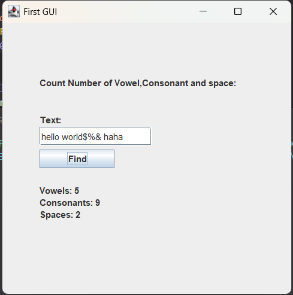
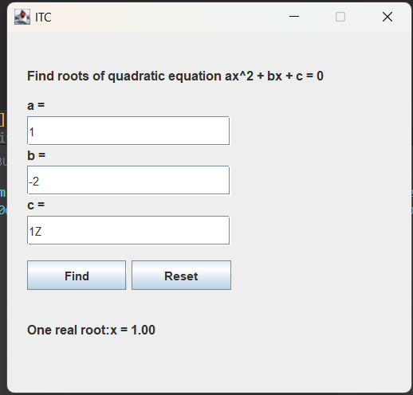
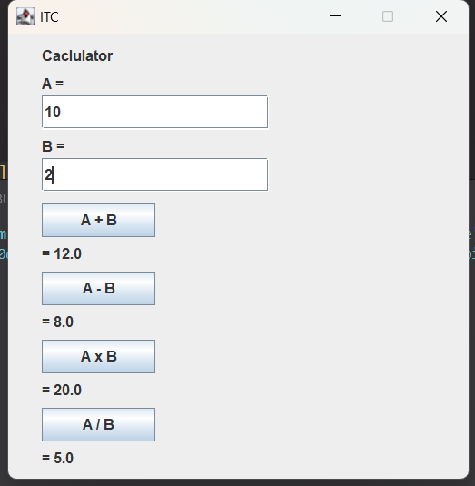

<p>
  
Name: Virak Rith

Student ID: P20230033

Course: OOP in java

Instructor: HOK Tin

Assignment: Lab06

Due Date: June 21, 2025 (11:59 AM)

</p>
<br/>

# Exercise 1

## Source Codes

```java
import java.util.Scanner;

class AbstractMath {
    int reverseNumber(int num){
        return 0;
    }

    int roundedNumber(double num){
        return 0;
    }

    int countDistinct(int[] values){
        return 0;
    }

    int decimalToBinary(int decimal){
        return 0;
    }
}

class Math extends AbstractMath {

    @Override
    int reverseNumber(int num) {
        int reverse = 0;
        while (num != 0) {
            int digit = num % 10;
            reverse = reverse * 10 + digit;
            num /= 10;
        }
        return reverse;
    }

    @Override
    int roundedNumber(double num) {
        int num_withno_decimal = (int) num;
        double decimal = num - num_withno_decimal;
        if (decimal >= 0.5)
            return num_withno_decimal + 1;
        else
            return num_withno_decimal;
    }

    @Override
    int countDistinct(int[] value) {
        int count = 0;
        for (int i = 0; i < value.length; i++) {
            boolean isDistinct = true;
            for (int j = 0; j < i; j++) {
                if (value[i] == value[j]) {
                    isDistinct = false;
                    break;
                }
            }
            if (isDistinct) {
                count++;
            }
        }
        return count;
    }

    @Override
    int decimalToBinary(int decimal) {
        int binary = 0, base = 1;
        while (decimal > 0) {
            int rem = decimal % 2;
            binary = binary + rem * base;
            base = base * 10;
            decimal = decimal / 2;
        }
        return binary;
    }
}


public class Main {
    public static void main(String[] args) {
        Scanner scanner = new Scanner(System.in);
        Math math = new Math();
        int choice;

        do {
            System.out.println("==== Menu ===");
            System.out.println("1. Reverse a number");
            System.out.println("2. Rounded number");
            System.out.println("3. Count distinct number");
            System.out.println("4. Decimal to Binary");
            System.out.println("5. Quit");
            System.out.print("Choose an opt: ");
            choice = scanner.nextInt();

            switch (choice) {
                case 1:
                    System.out.println("::: Reverse a number :::");
                    System.out.print("Input number: ");
                    int num = scanner.nextInt();
                    System.out.println("Output is: " + math.reverseNumber(num));
                    break;
                case 2:
                    System.out.println("::: Rounded number :::");
                    System.out.print("Input number: ");
                    double dnum = scanner.nextDouble();
                    System.out.println("Rounded is: " + math.roundedNumber(dnum));
                    break;
                case 3:
                    System.out.println("::: Count distinct numbers :::");
                    System.out.print("Enter total numbers: ");
                    int n = scanner.nextInt();
                    int[] values = new int[n];
                    for (int i = 0; i < n; i++) {
                        System.out.print("Enter number " + (i + 1) + ": ");
                        values[i] = scanner.nextInt();
                    }
                    System.out.println("Distinct count is: " + math.countDistinct(values));
                    break;
                case 4:
                    System.out.println("::: Decimal to Binary :::");
                    System.out.print("Input decimal number: ");
                    int decimal = scanner.nextInt();
                    System.out.println("Binary is: " + math.decimalToBinary(decimal));
                    break;
                case 5:
                    System.out.println("Exiting program...");
                    break;
                default:
                    System.out.println("Invalid choice, please try again...");
            }

            System.out.println();

        } while (choice != 5);

        scanner.close();
    }
}
```

## Output

```java
==== Menu ===
1. Reverse a number
2. Rounded number
3. Count distinct number
4. Decimal to Binary
5. Quit
Choose an opt: 1
::: Reverse a number :::
Input number: 2345
Output is: 5432

==== Menu ===
1. Reverse a number
2. Rounded number
3. Count distinct number
4. Decimal to Binary
5. Quit
Choose an opt: 2
::: Rounded number :::
Input number: 3.14
Rounded is: 3

==== Menu ===
1. Reverse a number
2. Rounded number
3. Count distinct number
4. Decimal to Binary
5. Quit
Choose an opt: 3
::: Count distinct numbers :::
Enter total numbers: 3
Enter number 1: 123
Enter number 2: 123
Enter number 3: 145
Distinct count is: 2

==== Menu ===
1. Reverse a number
2. Rounded number
3. Count distinct number
4. Decimal to Binary
5. Quit
Choose an opt: 4
::: Decimal to Binary :::
Input decimal number: 1234
Binary is: 1421075418

==== Menu ===
1. Reverse a number
2. Rounded number
3. Count distinct number
4. Decimal to Binary
5. Quit
Choose an opt:
```

# Exercise 2

## Source Code

```java
import java.util.Scanner;

class MathClass {

    public static int sum(int a, int b) {
        return a + b;
    }

    public static int sum(int a, int b, int c) {
        return a + b + c;
    }

    public static int sum(int[] arr) {
        int total = 0;
        for (int n : arr)
            total += n;
        return total;
    }

    public static int multiply(int a, int b) {
        return a * b;
    }

    public static int multiply(int a, int b, int c) {
        return a * b * c;
    }

    public static int multiply(int[] arr) {
        int result = 1;
        for (int n : arr)
            result *= n;
        return result;
    }

    public static int max(int a, int b, int c) {
        return Math.max(a, Math.max(b, c));
    }

    public static int max(int a, int b, int c, int d) {
        return Math.max(a, Math.max(b, Math.max(c, d)));
    }

    public static int max(int[] arr) {
        int max = arr[0];
        for (int n : arr)
            if (n > max) max = n;
        return max;
    }

    public static int min(int a, int b, int c) {
        return Math.min(a, Math.min(b, c));
    }

    public static int min(int a, int b, int c, int d) {
        return Math.min(a, Math.min(b, Math.min(c, d)));
    }

    public static int min(int[] arr) {
        int min = arr[0];
        for (int n : arr)
            if (n < min) min = n;
        return min;
    }

    public static double average(int a, int b, int c) {
        return (a + b + c) / 3.0;
    }

    public static double average(int a, int b, int c, int d) {
        return (a + b + c + d) / 4.0;
    }

    public static double average(int[] arr) {
        int sum = 0;
        for (int n : arr)
            sum += n;
        return (double) sum / arr.length;
    }

}

public class Main {
public static void main(String[] args) {
Scanner scanner = new Scanner(System.in);
int choice;

        do {
            System.out.println("\n==== Menu ====");
            System.out.println("1. Sum of two values");
            System.out.println("2. Sum of three values");
            System.out.println("3. Sum of many values");
            System.out.println("4. Multiply of two values");
            System.out.println("5. Multiply of three values");
            System.out.println("6. Multiply of many values");
            System.out.println("7. Max of three values");
            System.out.println("8. Max of four values");
            System.out.println("9. Max of many values");
            System.out.println("10. Min of three values");
            System.out.println("11. Min of four values");
            System.out.println("12. Min of many values");
            System.out.println("13. Average of three values");
            System.out.println("14. Average of four values");
            System.out.println("15. Average of many values");
            System.out.println("16. Quit");
            System.out.print("Choose an option: ");
            choice = scanner.nextInt();

            int a, b, c, d;
            int[] arr;

            switch (choice) {
                case 1:
                    System.out.print("Enter a: ");
                    a = scanner.nextInt();
                    System.out.print("Enter b: ");
                    b = scanner.nextInt();
                    System.out.println("Sum: " + MathClass.sum(a, b));
                    break;
                case 2:
                    System.out.print("Enter a: ");
                    a = scanner.nextInt();
                    System.out.print("Enter b: ");
                    b = scanner.nextInt();
                    System.out.print("Enter c: ");
                    c = scanner.nextInt();
                    System.out.println("Sum: " + MathClass.sum(a, b, c));
                    break;
                case 3:
                    arr = readArray(scanner);
                    System.out.println("Sum: " + MathClass.sum(arr));
                    break;
                case 4:
                    System.out.print("Enter a: ");
                    a = scanner.nextInt();
                    System.out.print("Enter b: ");
                    b = scanner.nextInt();
                    System.out.println("Product: " + MathClass.multiply(a, b));
                    break;
                case 5:
                    System.out.print("Enter a: ");
                    a = scanner.nextInt();
                    System.out.print("Enter b: ");
                    b = scanner.nextInt();
                    System.out.print("Enter c: ");
                    c = scanner.nextInt();
                    System.out.println("Product: " + MathClass.multiply(a, b, c));
                    break;
                case 6:
                    arr = readArray(scanner);
                    System.out.println("Product: " + MathClass.multiply(arr));
                    break;
                case 7:
                    System.out.print("Enter a: ");
                    a = scanner.nextInt();
                    System.out.print("Enter b: ");
                    b = scanner.nextInt();
                    System.out.print("Enter c: ");
                    c = scanner.nextInt();
                    System.out.println("Max: " + MathClass.max(a, b, c));
                    break;
                case 8:
                    System.out.print("Enter a: ");
                    a = scanner.nextInt();
                    System.out.print("Enter b: ");
                    b = scanner.nextInt();
                    System.out.print("Enter c: ");
                    c = scanner.nextInt();
                    System.out.print("Enter d: ");
                    d = scanner.nextInt();
                    System.out.println("Max: " + MathClass.max(a, b, c, d));
                    break;
                case 9:
                    arr = readArray(scanner);
                    System.out.println("Max: " + MathClass.max(arr));
                    break;
                case 10:
                    System.out.print("Enter a: ");
                    a = scanner.nextInt();
                    System.out.print("Enter b: ");
                    b = scanner.nextInt();
                    System.out.print("Enter c: ");
                    c = scanner.nextInt();
                    System.out.println("Min: " + MathClass.min(a, b, c));
                    break;
                case 11:
                    System.out.print("Enter a: ");
                    a = scanner.nextInt();
                    System.out.print("Enter b: ");
                    b = scanner.nextInt();
                    System.out.print("Enter c: ");
                    c = scanner.nextInt();
                    System.out.print("Enter d: ");
                    d = scanner.nextInt();
                    System.out.println("Min: " + MathClass.min(a, b, c, d));
                    break;
                case 12:
                    arr = readArray(scanner);
                    System.out.println("Min: " + MathClass.min(arr));
                    break;
                case 13:
                    System.out.print("Enter a: ");
                    a = scanner.nextInt();
                    System.out.print("Enter b: ");
                    b = scanner.nextInt();
                    System.out.print("Enter c: ");
                    c = scanner.nextInt();
                    System.out.println("Average: " + MathClass.average(a, b, c));
                    break;
                case 14:
                    System.out.print("Enter a: ");
                    a = scanner.nextInt();
                    System.out.print("Enter b: ");
                    b = scanner.nextInt();
                    System.out.print("Enter c: ");
                    c = scanner.nextInt();
                    System.out.print("Enter d: ");
                    d = scanner.nextInt();
                    System.out.println("Average: " + MathClass.average(a, b, c, d));
                    break;
                case 15:
                    arr = readArray(scanner);
                    System.out.println("Average: " + MathClass.average(arr));
                    break;
                case 16:
                    System.out.println("Exiting program.");
                    break;
                default:
                    System.out.println("Invalid choice.");
            }

        } while (choice != 16);
    }

    private static int[] readArray(Scanner scanner) {
        System.out.print("Enter number of elements: ");
        int n = scanner.nextInt();
        int[] arr = new int[n];
        System.out.println("Enter values:");
        for (int i = 0; i < n; i++){
            System.out.print("Enter index #" + (i + 1) + ": ");
            arr[i] = scanner.nextInt();
        }
        return arr;
    }

}
```

## Output:

```java
==== Menu ====
1. Sum of two values
2. Sum of three values
3. Sum of many values
4. Multiply of two values
5. Multiply of three values
6. Multiply of many values
7. Max of three values
8. Max of four values
9. Max of many values
10. Min of three values
11. Min of four values
12. Min of many values
13. Average of three values
14. Average of four values
15. Average of many values
16. Quit
Choose an option: 1
Enter a: 12
Enter b: 12
Sum: 24

==== Menu ====
1. Sum of two values
2. Sum of three values
3. Sum of many values
4. Multiply of two values
5. Multiply of three values
6. Multiply of many values
7. Max of three values
8. Max of four values
9. Max of many values
10. Min of three values
11. Min of four values
12. Min of many values
13. Average of three values
14. Average of four values
15. Average of many values
16. Quit
Choose an option: 2
Enter a: 12
Enter b: 2
Enter c: 3
Sum: 17
```

# Exercise 3

## Source Code:

```java

import java.awt.event.*;
import javax.swing.*;

public class ex3 {

    public static void main(String[] args) {
        JFrame f = new JFrame("First GUI");
        f.setSize(400, 400);
        f.setLayout(null);
        f.setVisible(true);
        f.setLocationRelativeTo(null);
        f.setDefaultCloseOperation(JFrame.EXIT_ON_CLOSE);

        JLabel t1, t2, result;
        t1 = new JLabel("Count Number of Vowel,Consonant and space: ");
        t2 = new JLabel("Text: ");
        result = new JLabel();
        f.add(t1);
        f.add(t2);
        f.add(result);
        t1.setBounds(50, 30, 350, 100);
        t2.setBounds(50, 80, 350, 100);
        result.setBounds(50, 190, 200, 100);

        JTextField input = new JTextField();
        JButton find = new JButton("Find");
        f.add(input);
        f.add(find);
        input.setBounds(50, 140, 150, 25);
        find.setBounds(50, 170, 100, 25);

        find.addActionListener(new ActionListener() {
            public void actionPerformed(ActionEvent e) {
                String text = input.getText().toLowerCase();
                int vowels = 0, consonants = 0, spaces = 0;

                for (int i = 0; i < text.length(); i++) {
                    char c = text.charAt(i);
                    if (Character.isLetter(c)) {
                        if ("aeiou".indexOf(c) != -1) {
                            vowels++;
                        } else {
                            consonants++;
                        }
                    } else if (c == ' ') {
                        spaces++;
                    }
                }

                String message = "<html>Vowels: " + vowels
                        + "<br>Consonants: " + consonants
                        + "<br>Spaces: " + spaces + "</html>";

                result.setText(message);
            }
        });

    }
}

```

## Output:

<p></p>

# Exercise 4

## Source Code:

```java

import java.awt.Font;
import java.awt.event.ActionEvent;
import java.awt.event.ActionListener;
import javax.swing.JButton;
import javax.swing.JFrame;
import javax.swing.JLabel;
import javax.swing.JTextField;

public class ex4 {

    public static void main(String[] args) {
        JFrame frame = new JFrame("ITC");
        frame.setSize(420, 400);
        frame.setResizable(false);
        frame.setLocationRelativeTo(null);
        frame.setDefaultCloseOperation(JFrame.EXIT_ON_CLOSE);

        JLabel label1 = new JLabel("Find roots of quadratic equation ax^2 + bx + c = 0");
        label1.setFont(new Font("Arial", Font.BOLD, 13));
        label1.setBounds(20, 20, 400, 50);

        JLabel aLabel = new JLabel("a =");
        aLabel.setFont(new Font("Arial", Font.BOLD, 13));
        aLabel.setBounds(20, 50, 100, 50);

        JTextField aTextField = new JTextField();
        aTextField.setBounds(20, 85, 205, 30);

        JLabel bLabel = new JLabel("b =");
        bLabel.setFont(new Font("Arial", Font.BOLD, 13));
        bLabel.setBounds(20, 100, 100, 50);

        JTextField bTextField = new JTextField();
        bTextField.setBounds(20, 135, 205, 30);

        JLabel cLabel = new JLabel("c =");
        cLabel.setFont(new Font("Arial", Font.BOLD, 13));
        cLabel.setBounds(20, 150, 100, 50);

        JTextField cTextField = new JTextField();
        cTextField.setBounds(20, 185, 205, 30);

        JButton button = new JButton("Find");
        button.setBounds(20, 230, 100, 30);
        button.setFocusable(false);

        JButton resetBtn = new JButton("Reset");
        resetBtn.setBounds(125, 230, 100, 30);
        resetBtn.setFocusable(false);

        JLabel resultLabel = new JLabel();
        resultLabel.setFont(new Font("Arial", Font.BOLD, 13));
        resultLabel.setBounds(20, 270, 400, 60);

        button.addActionListener(new ActionListener() {
            public void actionPerformed(ActionEvent e) {
                try {

                    double a = Double.parseDouble(aTextField.getText());
                    double b = Double.parseDouble(bTextField.getText());
                    double c = Double.parseDouble(cTextField.getText());

                    if (a == 0) {
                        resultLabel.setText("This is not a quadratic equation (a must not be 0).");
                        return;
                    }

                    double delta = (b * b) - 4 * a * c;

                    if (delta > 0) {
                        double root1 = (-b + java.lang.Math.sqrt(delta)) / (2 * a);
                        double root2 = (-b - java.lang.Math.sqrt(delta)) / (2 * a);
                        resultLabel.setText(String.format("<html>Two real roots:\nx1 = %.2f\nx2 = %.2f</html>", root1, root2));
                    } else if (delta == 0) {
                        double root = -b / (2 * a);
                        resultLabel.setText(String.format("One real root:\nx = %.2f", root));
                    } else {
                        resultLabel.setText("No real roots.");
                    }

                } catch (NumberFormatException ex) {
                    resultLabel.setText("Please enter valid number for a, b, and c.");
                }
            }
        });

        resetBtn.addActionListener(new ActionListener() {
            public void actionPerformed(ActionEvent e) {
                aTextField.setText("");
                bTextField.setText("");
                cTextField.setText("");
            }
        });

        frame.add(label1);
        frame.add(aLabel);
        frame.add(aTextField);
        frame.add(bLabel);
        frame.add(bTextField);
        frame.add(cLabel);
        frame.add(cTextField);
        frame.add(button);
        frame.add(resetBtn);
        frame.add(resultLabel);

        frame.setLayout(null);
        frame.setVisible(true);
    }
}

```

## Output:

<p></p>

# Exercise 5

## Source Code:

```java

import java.awt.Font;
import java.awt.event.ActionEvent;
import java.awt.event.ActionListener;
import javax.swing.ImageIcon;
import javax.swing.JButton;
import javax.swing.JFrame;
import javax.swing.JLabel;
import javax.swing.JTextField;

public class ex5 {

    public static void main(String[] args) {
        JFrame frame = new JFrame("ITC");
        frame.setSize(420, 430);
        frame.setResizable(false);
        frame.setLocationRelativeTo(null);

        // Set Logo to Frame
        ImageIcon logo = new ImageIcon("Image\\itc.png");
        frame.setIconImage(logo.getImage());

        JLabel calculator = new JLabel("Caclulator");
        calculator.setFont(new Font("Arial", Font.BOLD, 13));
        calculator.setBounds(30, 10, 300, 20);

        JLabel aLabel = new JLabel("A =");
        aLabel.setFont(new Font("Arial", Font.BOLD, 13));
        aLabel.setBounds(30, 35, 300, 20);

        JTextField aTextField = new JTextField();
        aTextField.setFont(new Font("Arial", Font.BOLD, 13));
        aTextField.setBounds(30, 55, 200, 30);

        JLabel bLabel = new JLabel("B =");
        bLabel.setFont(new Font("Arial", Font.BOLD, 13));
        bLabel.setBounds(30, 90, 300, 20);

        JTextField bTextField = new JTextField();
        bTextField.setFont(new Font("Arial", Font.BOLD, 13));
        bTextField.setBounds(30, 110, 200, 30);

        JButton addBtn = new JButton("A + B");
        addBtn.setFocusable(false);
        addBtn.setFont(new Font("Arial", Font.BOLD, 13));
        addBtn.setBounds(30, 150, 100, 30);

        JLabel addResult = new JLabel();
        addResult.setFont(new Font("Arial", Font.BOLD, 13));
        addResult.setBounds(30, 180, 300, 30);

        JButton subtractBtn = new JButton("A - B");
        subtractBtn.setFocusable(false);
        subtractBtn.setFont(new Font("Arial", Font.BOLD, 13));
        subtractBtn.setBounds(30, 210, 100, 30);

        JLabel subtractResult = new JLabel();
        subtractResult.setFont(new Font("Arial", Font.BOLD, 13));
        subtractResult.setBounds(30, 240, 300, 30);

        JButton multiplyBtn = new JButton("A x B");
        multiplyBtn.setFocusable(false);
        multiplyBtn.setFont(new Font("Arial", Font.BOLD, 13));
        multiplyBtn.setBounds(30, 270, 100, 30);

        JLabel multiplyResult = new JLabel();
        multiplyResult.setFont(new Font("Arial", Font.BOLD, 13));
        multiplyResult.setBounds(30, 300, 300, 30);

        JButton divideBtn = new JButton("A / B");
        divideBtn.setFocusable(false);
        divideBtn.setFont(new Font("Arial", Font.BOLD, 13));
        divideBtn.setBounds(30, 330, 100, 30);

        JLabel divideResult = new JLabel();
        divideResult.setFont(new Font("Arial", Font.BOLD, 13));
        divideResult.setBounds(30, 360, 300, 30);

        addBtn.addActionListener(new ActionListener() {
            public void actionPerformed(ActionEvent e) {
                try {
                    double a = Double.parseDouble(aTextField.getText());
                    double b = Double.parseDouble(bTextField.getText());
                    addResult.setText("= " + (a + b));
                } catch (Exception ex) {
                    ex.getMessage();
                    addResult.setText("Please Input Number first!");
                }
            }
        });

        subtractBtn.addActionListener(new ActionListener() {
            public void actionPerformed(ActionEvent e) {
                try {
                    double a = Double.parseDouble(aTextField.getText());
                    double b = Double.parseDouble(bTextField.getText());
                    subtractResult.setText("= " + (a - b));
                } catch (Exception ex) {
                    ex.getMessage();
                    subtractResult.setText("Please Input Number first!");
                }
            }
        });

        multiplyBtn.addActionListener(new ActionListener() {
            public void actionPerformed(ActionEvent e) {
                try {
                    double a = Double.parseDouble(aTextField.getText());
                    double b = Double.parseDouble(bTextField.getText());
                    multiplyResult.setText("= " + (a * b));
                } catch (Exception ex) {
                    ex.getMessage();
                    multiplyResult.setText("Please Input Number first!");
                }
            }
        });

        divideBtn.addActionListener(new ActionListener() {
            public void actionPerformed(ActionEvent e) {
                try {
                    double a = Double.parseDouble(aTextField.getText());
                    double b = Double.parseDouble(bTextField.getText());
                    divideResult.setText("= " + (a / b));
                } catch (Exception ex) {
                    ex.getMessage();
                    divideResult.setText("Please Input Number first!");
                }
            }
        });

        frame.add(calculator);
        frame.add(aLabel);
        frame.add(aTextField);
        frame.add(bLabel);
        frame.add(bTextField);
        frame.add(addBtn);
        frame.add(addResult);
        frame.add(subtractBtn);
        frame.add(subtractResult);
        frame.add(multiplyBtn);
        frame.add(multiplyResult);
        frame.add(divideBtn);
        frame.add(divideResult);

        frame.setLayout(null);
        frame.setVisible(true);
    }
}

```

## Output:

<p></p>

## Link to GitHub Account : [Click Here](https://github.com/Poppykhim/OOP-LAB.git) <3

Note: Viewing in VsCode IDE for better formatting!!!
